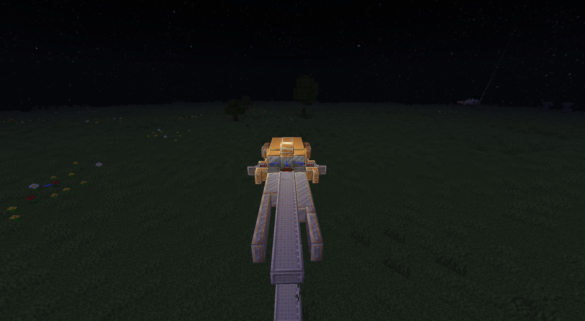
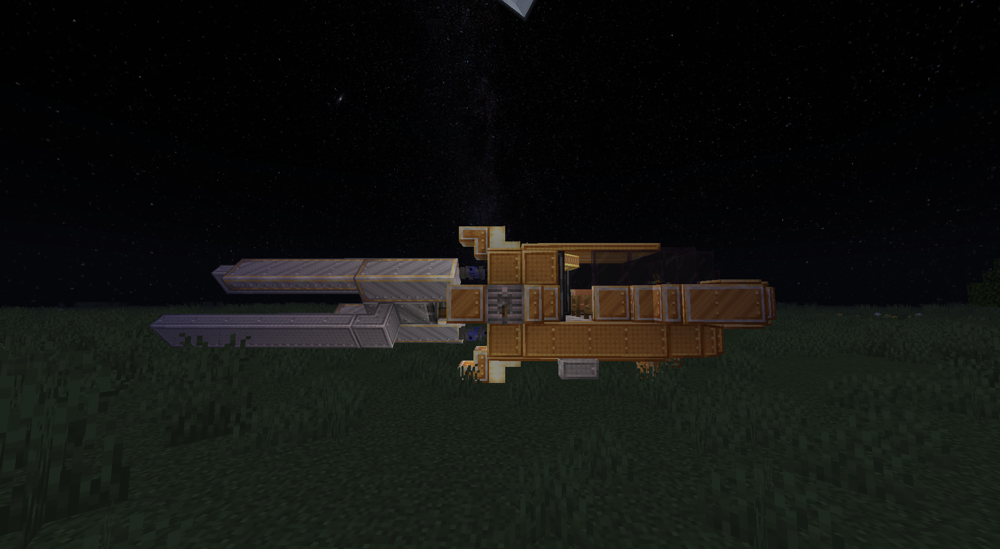
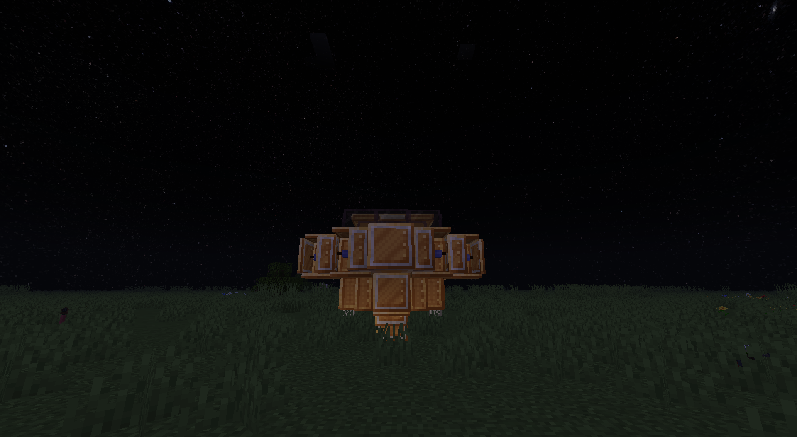
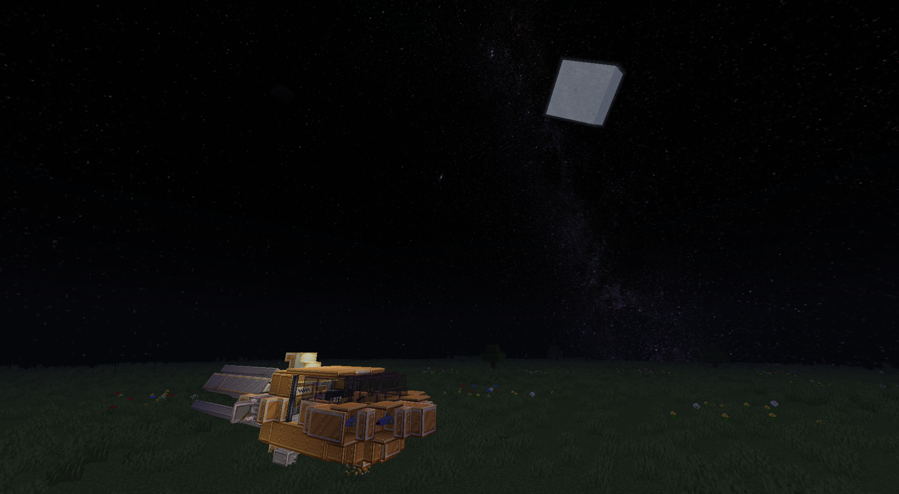
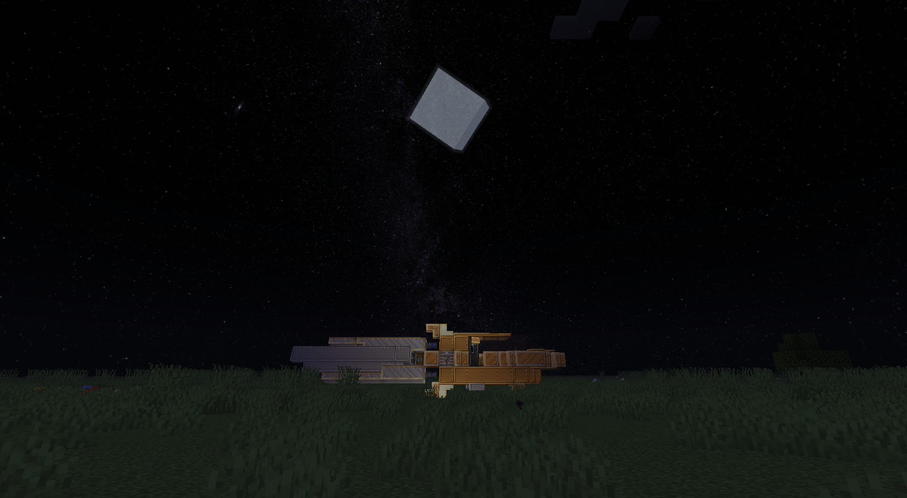

The sentient being that look like a squid sent their best architects and engineers, bringing their architectural code "SQ"s in every vehicle they have made.

Every SQ coded vehicle have the distinguishable squid or cuttlefish like anatomy, either it for useful utilities or just a mere ormament.

# SQ-1D1 Mark-I Light-Dropcraft

 

 

 

 

 

 

 

 

